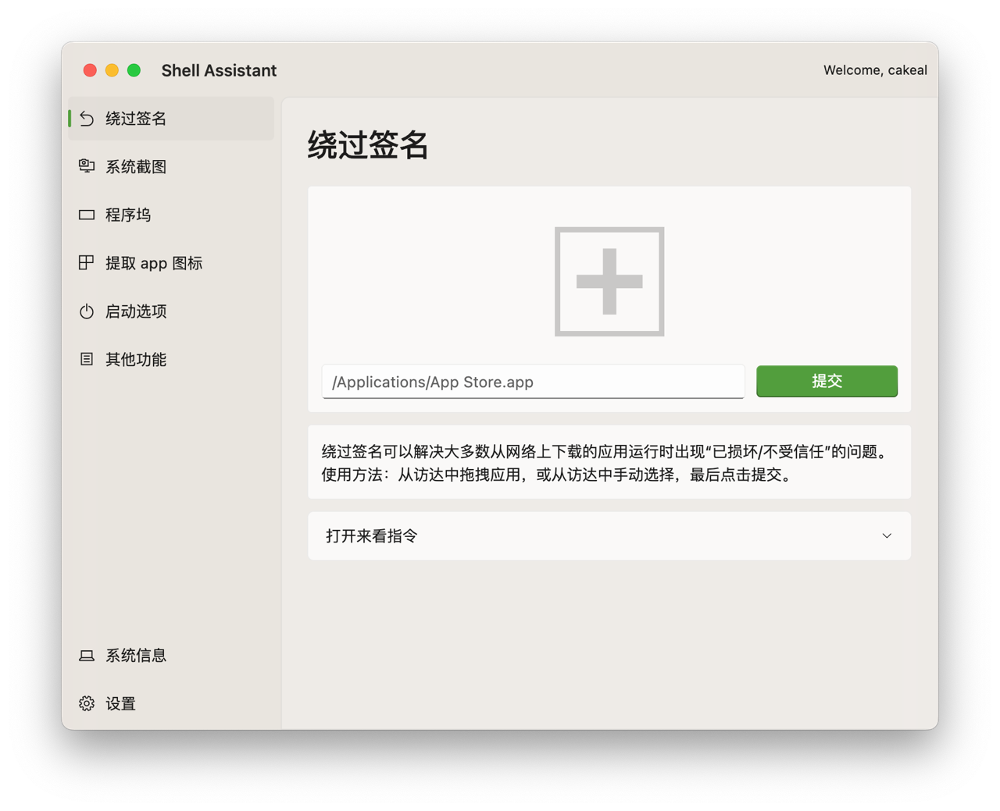

# Shell Assistant 果壳助手

## 简介

这是一个 Flutter + Rust 构建的APP，提供了若干 macOS 上的小功能。



## 功能一览

- 绕过 APP 签名
- 更改系统截图设置
- 更改程序坞设置
- 提取 APP 图标
- 启动选项
  - 阻止自动开机
  - 开机 Duang 一声的设置
- 其他功能
  - 打开壁纸文件夹
  - 打开动态壁纸文件夹（可以自行清理）
  - 打开录音文件夹
- 查看系统/硬盘/电池相关信息

## 下载

[点我跳转到 Release](https://github.com/CakeAL/shell_assistant/releases)

## 开发

需要准备 XCode, flutter, rust 环境，\
并安装 flutter-rust-bridge

```bash
just d
# or 
flutter run
```

## 构建

```bash
chmod +x build_releases.sh && ./build_releases.sh
```

会输出 x86 和 arm 的版本在 `release` 文件夹。